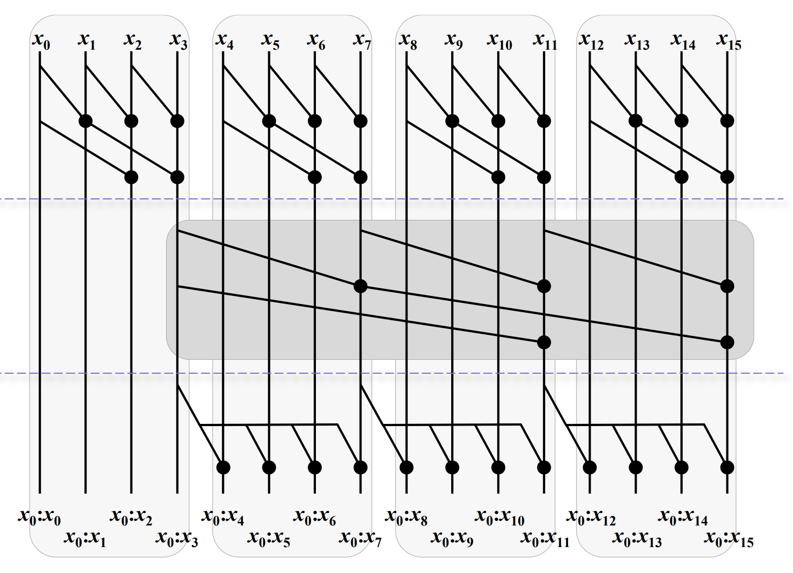

# oxyde_sorting

wgpu based sorting algorithm on top of [oxyde](https://github.com/dsmtE/oxyde) to do **couting sort** fully on GPU side.

## Requirements

The values on which the sorting is done should be in a dedicated buffer (`wgpu::Buffer`).

The sorting produce a buffer of sorted ids (the index of the sorted values) to be able to use it on other buffers (from which the values for sorting are produced for example).

## How it works

The **counting sort** is done in **3** steps:
1. Counting the number of elements in each bucket (atomic operation)
2. Scanning (prefix sum) the count buffer to get the starting index of each bucket
3. Write ids using the count buffer (atomic operation) to know where to write the id in the sorting id buffer
   > :warning: The counting sort **isn't stable** as the last step is done in **parallel** and the order of the elements in the same bucket (same sorting value) isn't preserved during this step.

The **scan** part is done in **3** steps:
1. The Scan part is done using the **Kogge-Stone** method at the **workgroup level**.
2. Then a **second scan** is done on the bigger values of each previous workgroup.
3. Finally, a **propagation** step is done to propagate the bigger values on the previous workgroups to get the final scan.

Here an illustration of the scan part: (from this [paper](https://rd.yyrcd.com/CUDA/2022-03-14-Single-pass%20Parallel%20Prefix%20Scan%20with%20Decoupled%20Look-back.pdf))

### Limitations
- The scan part should be implemented using deviceMemoryBarrier but it's not available in wgpu [yet](https://raphlinus.github./gpu/2021/11/17/prefix-sum-portable.html).
- Unable to use pushConstant feature in wgsl yet that's force us to duplicate the scan pipeline for the sub scan part.

### Interesting links:

- [State of the art: Single-pass Parallel Prefix Scan with Decoupled Look-back](https://rd.yyrcd.com/CUDA/2022-03-14-Single-pass%20Parallel%20Prefix%20Scan%20with%20Decoupled%20Look-back.pdf)
- [wgpu: prefix-sum-portable](https://raphlinus.github./gpu/2021/11/17/prefix-sum-portable.html)
- [Unity GPUPrefixSums](https://github.com/b0nes164/GPUPrefixSums)
- [courses notes : irgpu_patterns](https://lemasyma.github.io/cours/posts/irgpu_patterns/#scan-pattern-at-the-block-or-grid-level)

